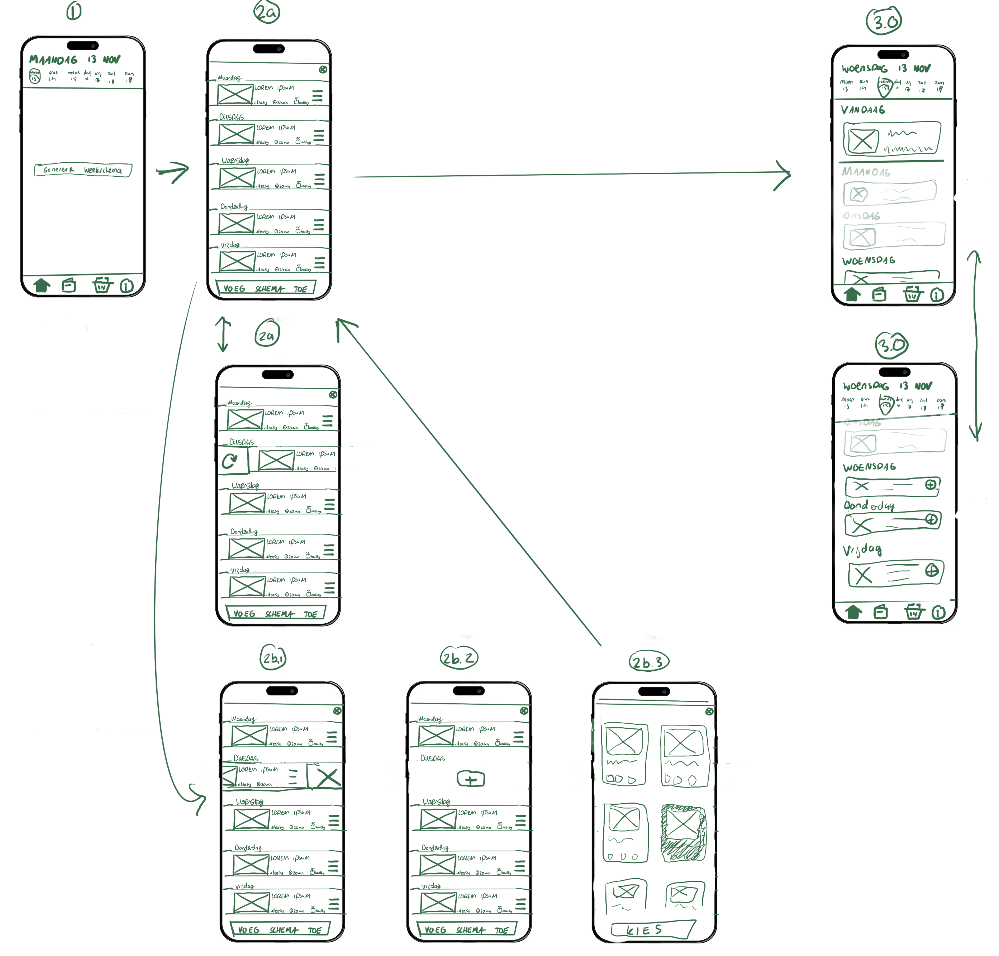
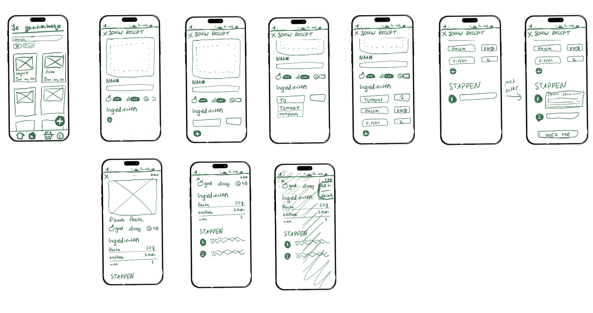
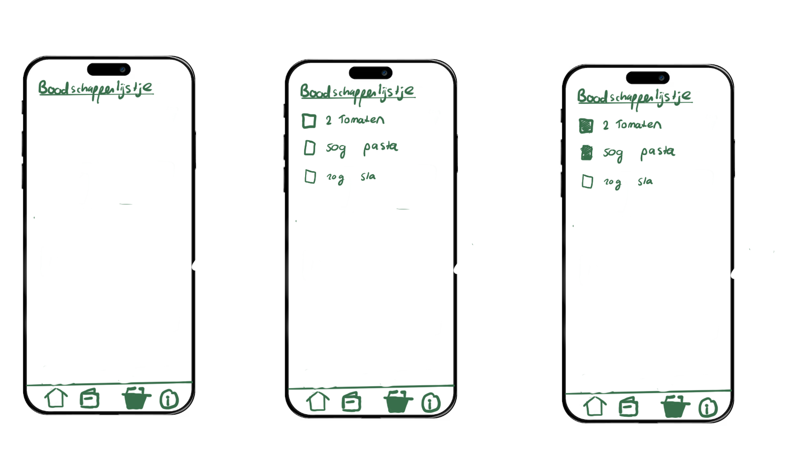
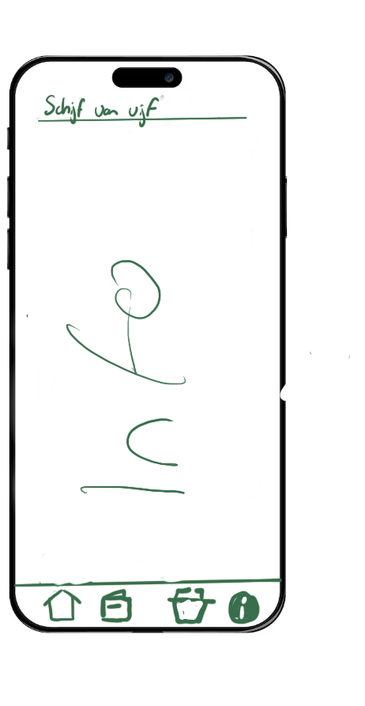
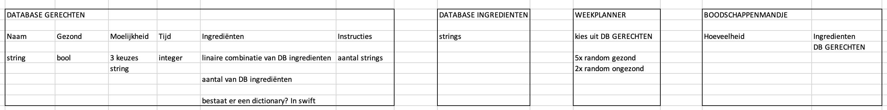

## MealMediate: jouw persoonlijke maaltijdplanner met je eigen vertouwde gerechten

### Wat is het probleem (niet de oplossing) dat jouw project gaat oplossen?

Je kent het wel. Het is tijd om te bedenken wat je gaat avondeten (of je moeder vraagt waar je trek in hebt) en spontaan gaan je hersenen op blanco en ben je elk gerecht dat je ooit hebt gemaakt vergeten.  
Het zal je maar gebeuren dat je een drukke student bent en je elke avond met deze crisis te maken hebt. Daarbij moet je ook nog nadenken over de boodschappen hiervoor.  
Door alle stress kies je al snel vertrouwd Pasta Pesto. Twee keer in de week kan nog wel, maar of het nou zo gozond is om dat elke dag te doen...  
Wat is de oplossing van al onze problemen? "Een planning!" Laat deze app jouw helpende handje zijn.

 

### Wie zijn je verwachte gebruikers?

De verwachte gebruiker ben ikzelf, althans mijn toekomstige zelf. Ik woon nu nog met mijn ouders, maar als ik op mij zelf ga wonen zou ik het heel prettig vinden om een helpend handje te hebben met het nadenken over het avondeten. Ik vind het fijn om nu al gerechten "op te sparen". Ook is de app natuurlijk geschikt voor elke andere student die hiervan gebruik wilt maken.

 

### In welke setting wordt je project gebruikt? 

De app zal in portretmodus worden gebruikt. Als je een nieuw gerecht hebt geleerd kan je dit mooi in je eigen recepte boekje opslaan. 
Als het weekend is en je boodschappen wilt doen, kan je je weekplanning maken en vooruitdenken voor de aankomende week. 
Als het avond is en tijd om te koken, kan je de app erbij pakken om nog even het recept te bekijken.

 

### Wat doet jouw oplossing anders of beter dan bestaande oplossingen? Wat is je niche? 

Mijn app is eigenlijk een soort veredelde databse + planner + todolijst in één. Alles wat een mens doet voor het verzinnen van het avondeten, doet mijn app, zodat de lasten worden verlaagt.

De app werkt als volgt:
1) Voeg gerechten toe in je eigen "gerechteboekje" die je zelf kent. Zorg dat ze zijn afgestemt op het aantal porties dat je in 1 dag eet.
2) Bepaal aan de hand van de schijf van vijf (info daarover in de app) of je gerecht gezond of ongezond is**
3) Genereer je weekschama
4) Voeg je ingredienten toe aan je eigen "boodschappenlijstje"

Mijn app is uniek dan andere maaltijd apps omdat:
- Voor bestaande oplossingen moet je veel betalen, en je moet per se kiezen uit bestaande gerechten.
- Of je kan met een app al je eigen gerechten opslaan, maar geen wekelijkse planning creeëren.
- Met mijn app moet je zelf kiezen of een gerecht gezond of ongezond is. Dit werkt stimulerend om meer over gezond voedsel te leren, porties zijn belangrijjker dan specifieke getallen. 
- Mijn niche is de 'skere' drukke student met te weinig tijd in een dag, die een helpend handje nodig heeft. 
- Mijn app wordt een soort 'hellofresh', maar je kiest zelf de goedkoopste boodschappenwinkel en je eigen vertrouwde gerechten.

Kortom: Mijn app is een helpend handje, gebasseerd op je eigen voorkeuren.

** Mijn eerste idee was om de app zelf te laten bepalen of iets gezond of ongezond is. Na meer informatie opzoeken, blijkt dat het heel moeilijk is om dit te doseren aan de hand van een berekening. Gezond voedsel gaat veel meer om bepaalde porties dan specifieke getallen. (https://www.hsph.harvard.edu/nutritionsource/healthy-eating-plate/) De app is een helpend handje maar vervangt je eigen hersenen niet.

 

### Schets van oplossing

Druk op de knop bij (1) om een weekschema te genereren
Het algoritme kiest 6 gezonde gerechten uit, en 1 ongezond gerecht (2a).
Je kan nu zelf kiezen of je gerechten wilt verschuiven, opnieuw wil laten hergeneren (2a), of zelf uitkiezen (2b).
Vervolgens als je teverden bent met je keuze, krijg je het weekview te zien.
3.0 laat zien wat er gebeurd als een dag is verstreken: de vorige dagen worden donker.
Je kunt de toekomstige gerechten toevoegen aan het "boodschappenmandje".

Het gerechtenboekje spreekt heel erg voor zich. Het filteren en de zoekbalk heb ik voor nu toegevoegd, maar dit heeft een lagere prioriteit. 
Met de plus knop voeg je een nieuw gerecht toe. Als je op een bestaand gerecht drukt, kun je deze bekijken of aanpassen en verwijderen.

Het boodschappenlijstje is vrij simpel. Wanneer er in de Home pagina gerechten worden toegevoegd aan de TODO, verschijnen ze hier. Het is belangrijk dat dit goed update en 50g pasta + 50g pasta = 100g pasta laat zien. Wanneer een nieuw weekschema wordt gegenereerd, zal de TODO lijst leeg zijn.

De informatiepagina bevat geen interactieve knoppen maar is puur een soort samenvatting van het onderzoek dat ik heb gedaan. Dit heeft de laagste prioriteit. 

 

### Features

<u>Noodzakelijke features:</u>

Hoofdpagina:
- Knop met algoritme die weekplanning genereerd (doel van het project), gebasseerd op 6x gezond, 1x ongezond
- Knop waarmee je gerechten uit gegenereerde planning in boodschappenlijstje zet

Recepten-pagina:
- Knop voor toevoegen van gerechten
- Toevoegen van "Naam gerecht", gezond/ongezond, "Ingredienten" (Dit is minimaal nodig voor de weekplanning en het boodschappenlijstje)

Boodschappenlijstje-pagina:
- Als op de homepagina op de plus knop bij een gerecht wordt gedrukt, moet dit hier verschienen op de juiste manier, als een todolijst

Infopagina:
- Korte samenvatting van hoe gezond eten

 

<u>Sub features:</u>

Homepagina
- Het verschuiven van gerechten per dag
- Het opnieuw willekeurig genereren van een gerecht / ZELF een gerecht uitkiezen
- Kies op welke dag de weekplanning start

Recepten-pagina
- Extra toevoegeningen gerecht: plaatje, stappen
- Gerecht kunnen verwijderen
- Als een ingredient wordt toegevoegd dat nog niet bestaat, komt in een database. Als tomaat al bestaat en je schrijft "To", moet de optie tomaat worden laten zien
- Gerecht 

Boodschappenlijstje-pagina
- Items verschuiven en verwijderen wanener geschoven wordt
- Custom items toevoegen

Infopagina
- Breid de informatie uit

 

<u>Extra's (add ons voor uitbreiding project):</u>
- Bekijk wat je afgelopen week had gegeten
- Algoritme slimmer maken: wat als gezond/ongezond niet bool is maar bijv 3 keuzes (meer nuance)
- Verwerken in het algoritme hoe lekker iets is
- Nu vul je elk gericht in je recepteboekje in, precies dat het per dag voor jou het juiste portie is. Wat als je dit kunt aanpassen.
- Per ingredient, een database creeeren met alle voedingswaarden, zodat elke voedingswaarde per week kan worden bekekenen
- Genereer een willekeurig bestaand gerecht van internet in deze app, en sla heb op als je dit wilt toevoegen.

 

### Requirements
- Het beheren en behouden van data: Welk ingredient en hoveel zit er in een gerecht
- Een algoritme dat willekeurig 7 gerechten kist uit deze databse
- Boodschappenlijstje dat wordt geupdate 

 

Alle data(bases) die hier samenwerken is als volgt:

 

### Wat wordt moeilijk?
- De app gebruikt veel views
- Zorgen dat het toevoegen van data en weghalen van data goed lukt, vanuit de app zelf
- Het linken van data is daarbij erg belangrijk (het overzicht niet verliezen)
- Van sommige ingredienten heb je 200g nodig, en bij andere een integer getal. Er moet dus een conversie gaan plaatsvinden waarbij een deel van de string wordt weggehaald zodat alleen het getal overblijft.
- Ik wil vooral de basis goed hebben, zodat ik hierop meer complexiteit kan bouwen.

 

### Projectvoorstel feedback
- Ik heb mijn voorstel vrij concreet en beknopt gehouden, maar er is veel ruimte voor extra functies binnen de app. Graag hoor ik feedback over welke add-ons realistisch zijn om toe te voegen binnen de tijd. 