

  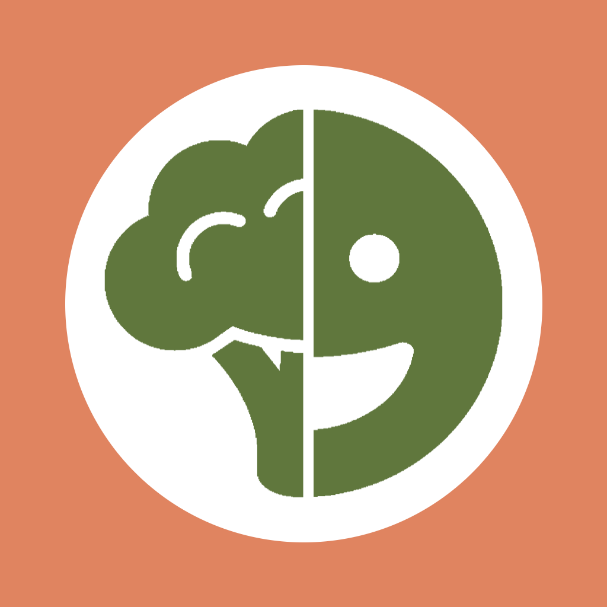
  <h1>MealMediate: Jouw Persoonlijke Maaltijdplanner</h1>

### Beschrijving:
MealMediate is jouw persoonlijke maaltijdplanner waarmee je gemakkelijk en snel een gezonde weekplanning kunt genereren op basis van een database met jouw favoriete gerechten. Categorisier jouw gerechten gebasseerd op bepaalde kenmerken. Geen stress meer over wat je moet eten, en geen eindeloze herhaling van dezelfde maaltijden. De app helpt je ook bij het samenstellen van een boodschappenlijstje, zodat je efficiënt inkopen kunt doen.

### Gebruikers:
MealMediate is ideaal voor drukke studenten en iedereen die op zoek is naar een eenvoudige oplossing voor maaltijdplanning. De app is ontworpen om intuïtief en gebruiksvriendelijk te zijn, zodat het een handig hulpmiddel is voor iedereen die wat variatie in hun eetpatroon wil brengen. De gebruiker kan zelf bepalen of een gerecht gezond of ongezond is

### Gebruiksinstelling:
MealMediate is een app ontworpen om in portretmodus te worden gebruikt. Je kunt gemakkelijk je eigen receptenboekje aanleggen, gerechten toevoegen en wijzigen, een weekplanning maken en tijdens het koken snel de benodigde ingrediënten raadplegen. Support voor light mode en dark mode.

### Unieke Kenmerken:
- Persoonlijk Receptenboekje: Voeg je favoriete gerechten toe met verschillende details, en pas een gerecht aan wanneer je wilt. 
- Gezonde Weekplanning: De app genereert een weekplanning met willekeurig gezonde en gekozen aantal ongezonde gerechten.
- Boodschappenlijstje: Stel gemakkelijk een boodschappenlijstje samen op basis van je weekplanning, of voeg andere gerechten toe.
- Flexibiliteit: Pas de planning aan gebasseerd op je gekozen begindag, kies zelf gerechten of laat de app willekeurig suggesties doen.

### Afbeeldingen:
| 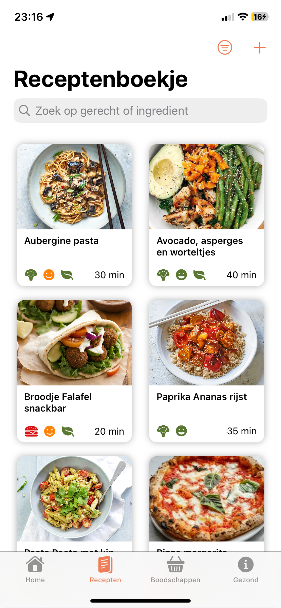 | 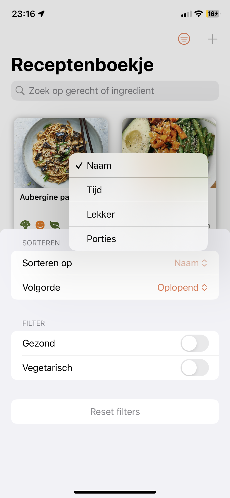 | 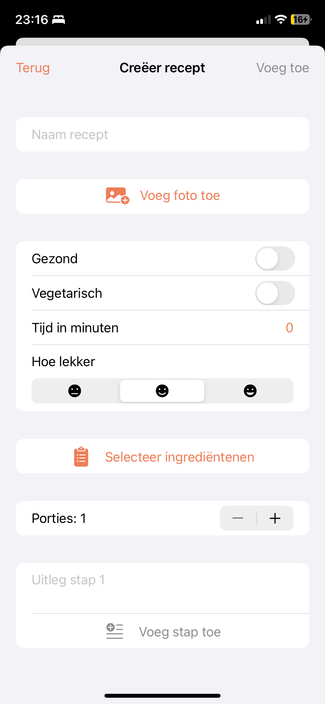 | 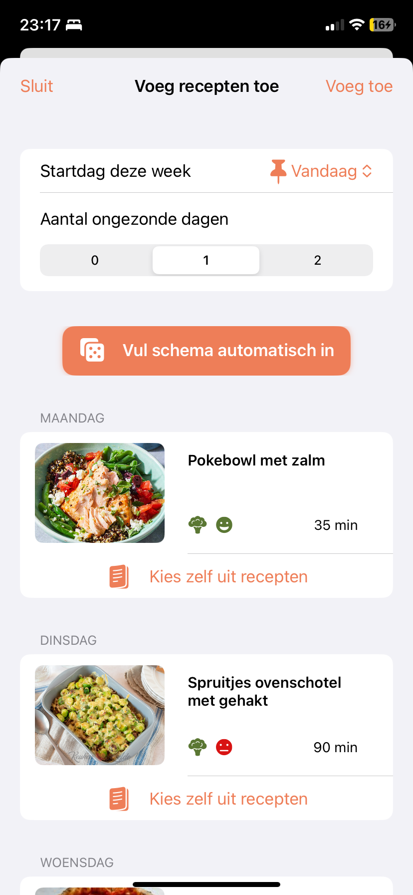 | 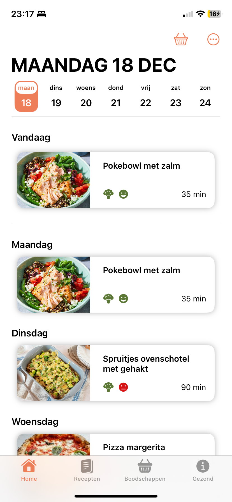 | 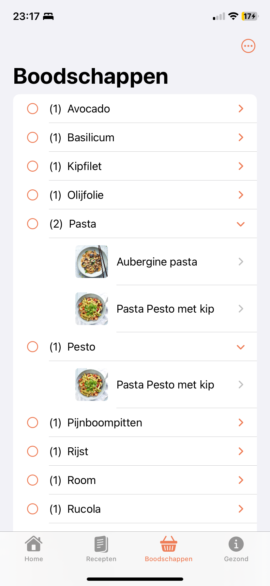 |
|-----------------------------------------------------------------------------|---------------------------------------------------------------------------------|---------------------------------------------------------------------------|---------------------------------------------------------------------------|-------------------------------------------------------------------------------------|-----------------------------------------------------------------------|
| 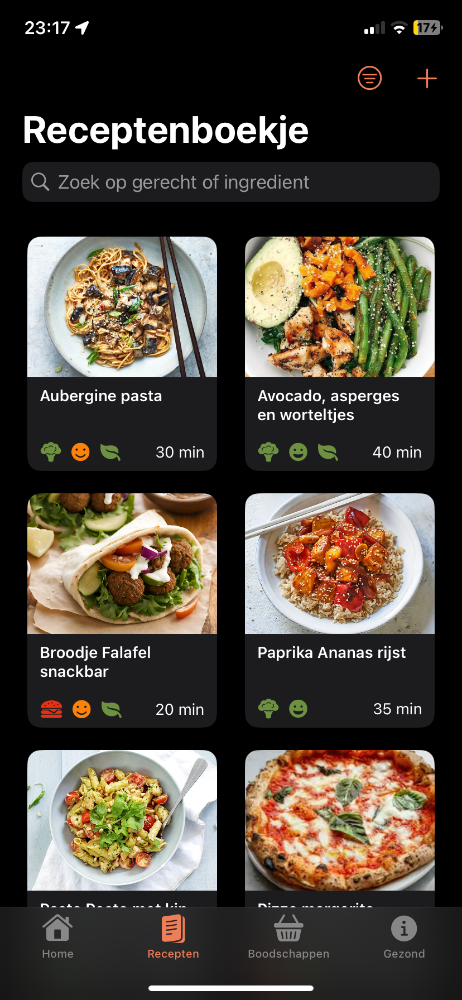     | 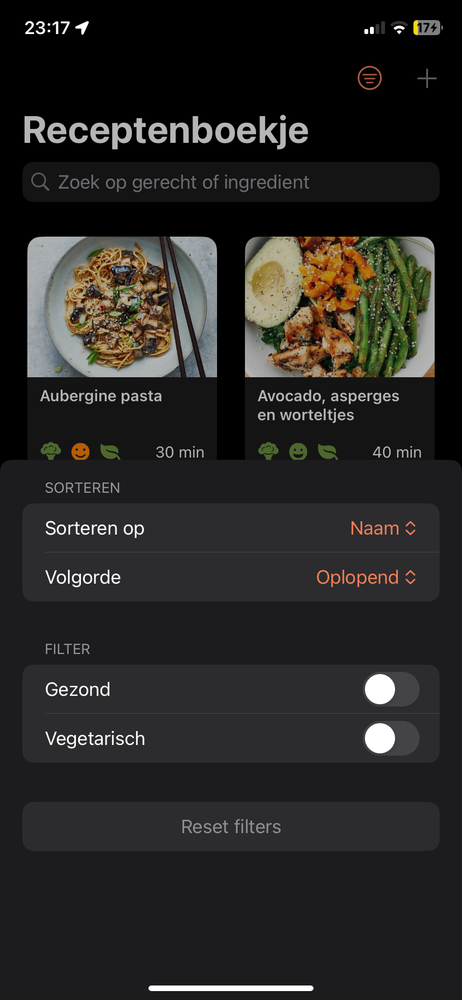     | 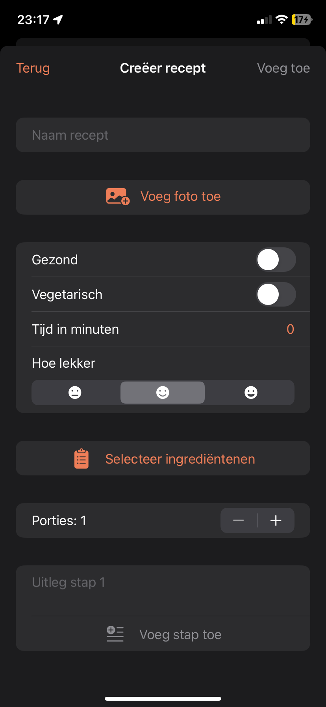     | 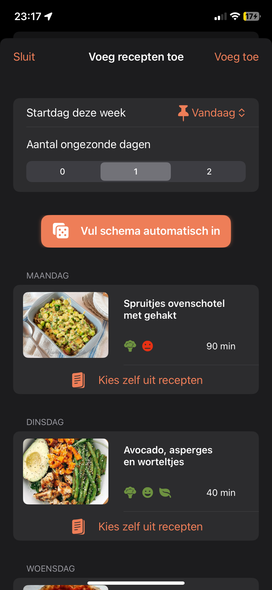     | 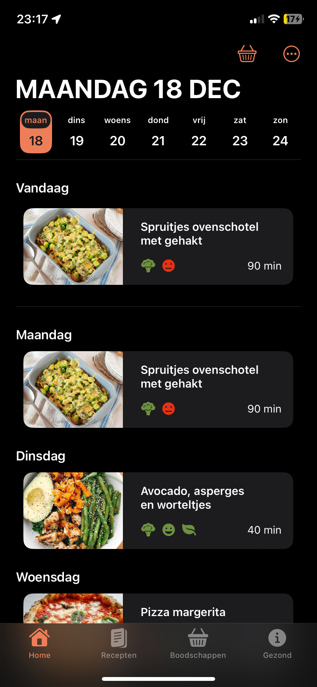     | 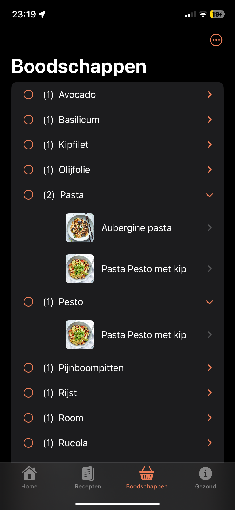     |

### Screencast:

### Installatie:
Clone de repository naar je lokale machine.
Open de app in Xcode of een andere geschikte ontwikkelomgeving voor iOS.
Zorg ervoor dat je Xcode bijgewerkt is naar versie 5 of hoger.
Installeer alle benodigde dependencies volgens de instructies in het project.
Voer de app uit op een iOS-simulator of op een fysiek iOS-apparaat met iOS 17 of hoger.

### Bronnen en Referenties:
Many to many relationship code inspiration: 
NoteAppSwiftData - alfianlosari (gitbhub, open source)

Saving image and JSON decoder: 
youtube-content-2023 - tunds (github, open source)

Website naar voedingscentrum: 
https://www.voedingscentrum.nl/nl.aspx

 

**Gemaakt door: Salomé Poulain**